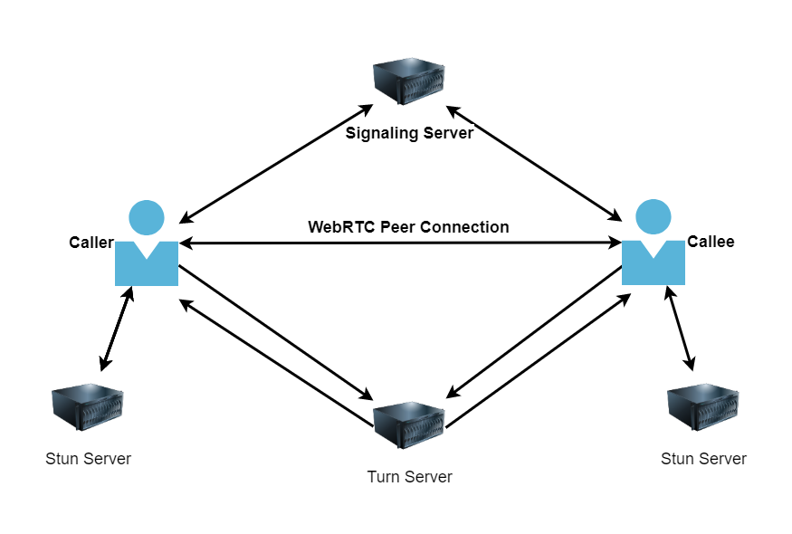
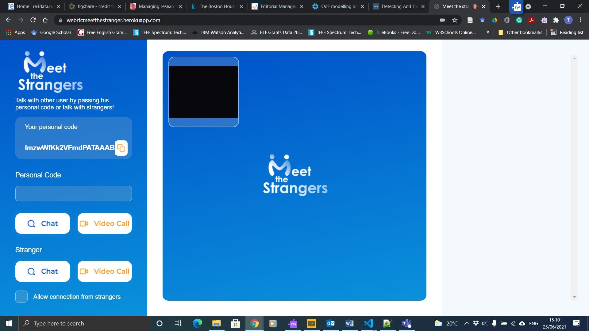

# WebRTC Meet the Strangers
 Omegle clone with direct calls possibility with vanilla JavaScript

 ### Author: Timothy Lam 
\
Link - http://localhost:3000

Link - https://webrtcmeetthestranger.herokuapp.com/

## Installation Nodejs

```
npm init
```

```
npm install --save express
```

```
npm install --save socket.io
```

## Installation nodemon

```
npm install nodemon
```

## How to use 

```
npm install
```

```
npm start
```

## WebRTC Architecture


## WebRTC Meet the Strangers

\
\
\
\
[](https://forthebadge.com)
[](https://forthebadge.com)